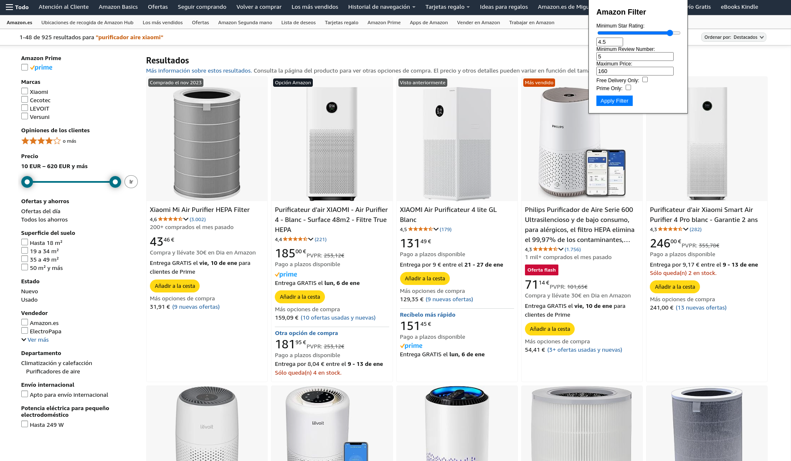
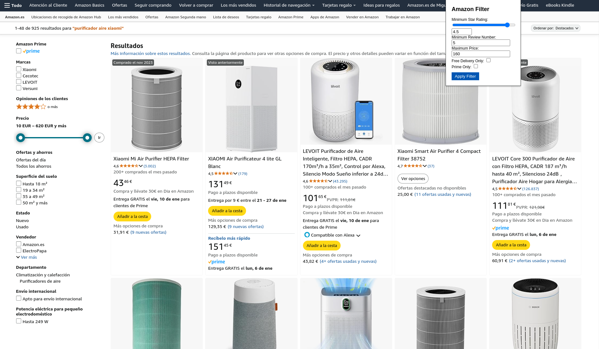

# Star Rating Filter Chrome Extension

## Overview

The **Star Rating Filter** is a Chrome extension designed to help users filter products on Amazon's search results page based on their preferences. It allows users to apply filters such as minimum star rating, review count, maximum price, free delivery, and Prime eligibility.

## Features

- **Filter by Star Rating**: Set a minimum star rating for products.
- **Filter by Review Count**: Specify the minimum number of reviews required for a product.
- **Filter by Price**: Set a maximum price threshold.
- **Free Delivery Only**: Show only products with free delivery.
- **Prime Only**: Show only Amazon Prime products.
- **User Preferences**: Automatically saves filter settings using Chrome's storage.

## Screenshots

### Before Applying the Filter:

### After Applying the Filter:

## Files

### 1. `popup.js`
Contains the JavaScript logic to:
- Retrieve and save user preferences using Chrome's storage.
- Listen for input changes and synchronize filter values between the range slider and number input.
- Apply filters to Amazon search result divs by modifying their `display` property.

### 2. `popup.html`
Defines the HTML structure of the extension's popup interface, including:
- Range slider and input for star ratings.
- Number input fields for review count and maximum price.
- Checkboxes for free delivery and Prime filters.
- A button to apply the filters.

### 3. `popup.css`
Styles the popup interface, providing a clean and user-friendly design.

### 4. `manifest.json`
Defines the extension's metadata, permissions, and entry points:
- Uses Manifest V3.
- Requires permissions for `scripting`, `activeTab`, and `storage`.

## Installation

1. Clone or download this repository.
2. Go to `chrome://extensions/` in your browser.
3. Enable **Developer mode** in the top-right corner.
4. Click **Load unpacked** and select the folder containing the project files.
5. The extension should now be visible in your Chrome extensions bar.

## Usage

1. Open Amazon's search results page.
2. Click on the **Star Rating Filter** extension icon.
3. Set your desired filters:
   - Use the range slider or number input for star ratings.
   - Input numbers for minimum reviews and maximum price.
   - Toggle the checkboxes for free delivery and Prime products.
4. Click **Apply Filter**.
5. The search results on the page will update to match your filter preferences.

## Technical Details

### Filter Logic
- Filters are applied by hiding product `div` elements that don't meet the criteria.
- The script dynamically evaluates each product's:
  - Star rating
  - Review count
  - Price
  - Prime eligibility
  - Free delivery status

### Chrome Storage
- Filter settings are saved using Chrome's `storage.sync` API, enabling persistence across browser sessions.

### Permissions
- `scripting`: To inject and execute scripts on the active tab.
- `activeTab`: To access the active tab's content.
- `storage`: To save and retrieve filter preferences.

## Limitations

- Designed specifically for Amazon's desktop site structure. Changes to Amazon's DOM will require updates to the extension.
- May not work on all Amazon regional sites due to language and layout differences.

## Future Enhancements

- Add support for more than 1 amazon region
- Only enable extension for amazon domains